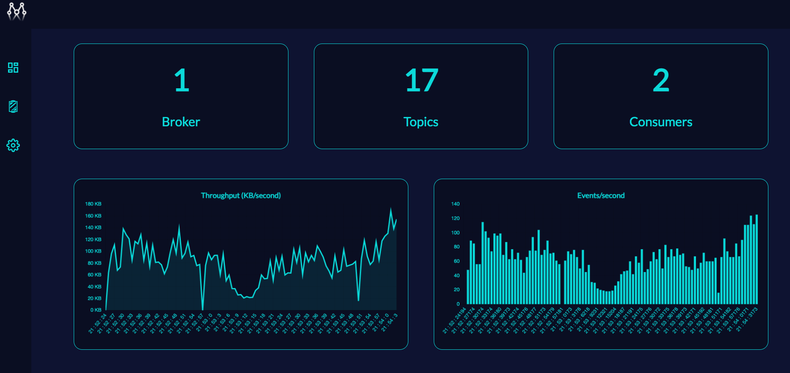

# KafkaMirror


## Table of Contents
#### Overview
#### Demo
#### Quick Start
#### Viewing your metrics
#### Open-Source Kafka simulator tool

## Overview
- Monitor your Kafka application in real-time
- Track throughput, events per second
- Easily integrate KafkaMirror to your existing application
- Compatible with Kafka applications utilizing KafkaJS

KafkaMirror allows for easy, highly accurate monitoring of your kafka cluster in real-time. By directly accessing the log data for your kafka cluster, KafkaMirror delivers precise, reliable feedback which can be used to improve system health and identify irregularities. 

## Screenshot
<br>

## Quick Start
A few simple steps to initialize KafkaMirror:
1. ```npm install kafka-mirror-connect```
2. In the file where you initialize your KafkaJS to connect with your Kafka Cluster, require in kafka-mirror connect.
3. Replace new Kafka with a call to KafkaMirror. Example below:<br>
<br>
 <br>
 
## Viewing your metrics
The KafkaMirror GUI can be used to view your metrics. 
1. Clone this repo (https://github.com/oslabs-beta/KafkaMirror.git)
2. cd into KafkaMirror
3. Start the application with npm run build
4. Navigate to localhost:3000
5. Within the GUI, navigate to the setting page and enter the location (e.g. port 9092) of your Kafka cluster.

## Open source Kafka simulator
- https://github.com/oslabs-beta/kafka-simulator 
  - preconfigured to work with KafkaMirror

The KafkaMirror GUI can be used to view your metrics. 

## Authors
KafkaMirror Engineers:<br>
[Mark Miller](https://github.com/markmanuelmiller)<br>
[Joe Kinney](https://github.com/joekinney-png)<br>
[Toby Rhodes](https://github.com/rtobiwan)<br>
[Keon Kim](https://github.com/Keon-Kim-0)<br>
[Jonah Stewart](https://github.com/jonahlstewart)<br>
